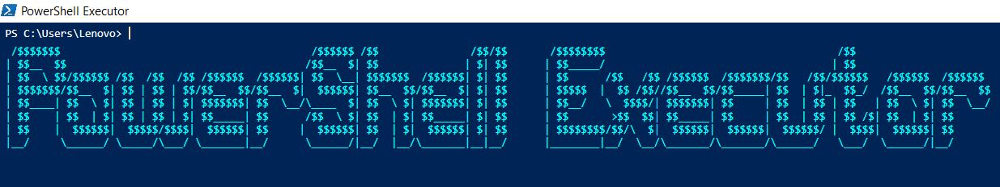
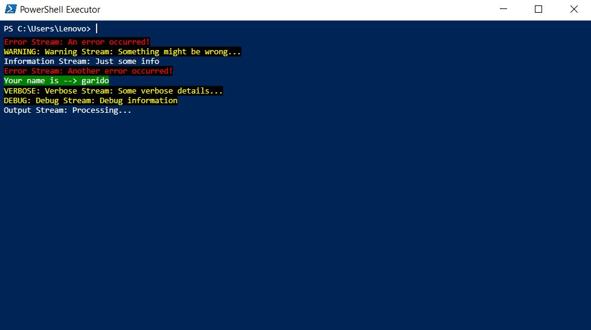

# PowerShell Executor

PowerShell Executor is a WPF-based desktop application that provides an interactive GUI for executing PowerShell commands, viewing structured output, and supports features like command history and input completion.

## Features

### Command Execution
   - Users can execute PowerShell commands directly from the main interface
   - The results of executed commands are displayed in the result area the same way they would be printed in the powershell
   - Support for PowerShell commands that interact with the host:
     - `Clear-Host`
     - `Read-Host`
     - `Write-Host`
     - `Exit-Host` *\*Note: Because the host interaction was implemented through Cmdlet overrides, and because `exit` is a PowerShell keyword, `exit` command has no effect, and `Exit-Host` can be used instead**

### Command History
   - Navigate through command history consisting of previously executed commands

### Rich Output
   - Other than command result, PowerShell streams are also displayed and styled in their own way
   - The streams include: Error, Warning, Debug, Verbose and Information stream

### Command Completion
   - While entering commands, the app supports completion to simplify the command-writing process
   - Users can cycle through suggested completions

---

## Usage 

**Command Execution:**
   - Input PowerShell commands into the input field located at the top of the window, next to the working directory display
   - Press `Enter` to run the command
   - The result of the execution will be displayed underr the input field

**Command Completion:**
   - Press `Tab` to get the completions for the partially entered command
   - By continuing to press `Tab` you can cycle through all of the available completions 

**History Navigation:**
   - Press `UpArrow` to move to older commands
   - Press `DownArrow` to return to more recent commands

**Clearing Output:**
   - Press `Escape` to clear the current input

---

## Examples

 

---
Running the [example2_script.ps1](Examples/example2_script.ps1)

 

  
